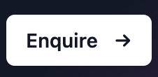

#lit-tw-link

```javascript
import `/src/components/lit-tw-link/lit-tw-link.js`;
```

```html
<script
  type="module"
  src="/src/components/lit-tw-link/lit-tw-link.js"
></script>
```

## Attributes

- **link** String
- **variant** [primary, secondary, complex]
- **linkLabel** String
- **hasArrow** Boolean

## Slots

- **header**
- **footnote**

## Default


```html
<lit-tw-link linkLabel="Learn more"
  >Ex qui id voluptate ullamco ullamco</lit-tw-link
>
```

## Primary with arrow



````html
<lit-tw-link variant="primary" link="#" hasarrow>Duis voluptate mollit deserunt Lorem.</lit-tw-link>
````

## Secondary


```html
<lit-tw-link variant="secondary" hasarrow link="#"> Enquire </lit-tw-link>
````

## Complex


```html
<lit-tw-link variant="complex" linkText="Learn more"
  >Announcing real estate portal.</lit-tw-link
><
````
